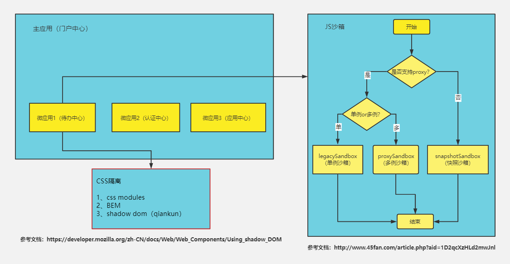
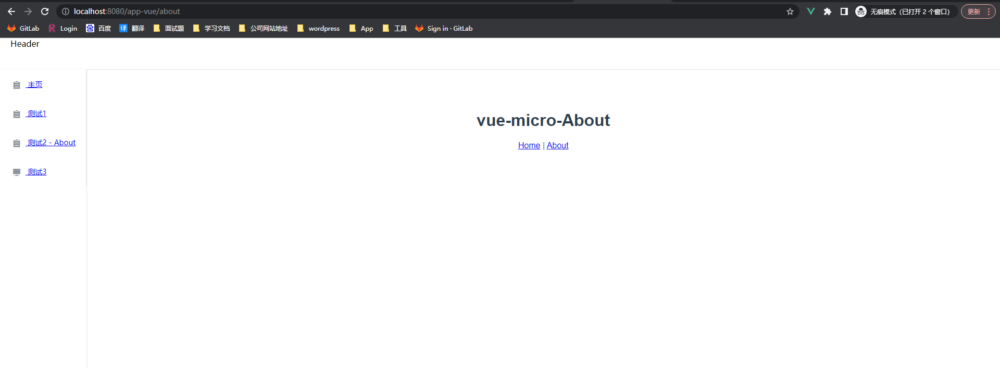

# qiankun-demo

### 介绍
基于qiankun微前端实践，主应用vue,微应用vue、react

### 项目启动顺序

1. qiankun-base: npm run serve
2. qiankun-vue: npm run serve
3. qiankun-react: npm run start

启动顺序不一致可能会有端口问题，可取qiankun-base中修改main.js子应用端口设置

### qiankun介绍

https://qiankun.umijs.org/zh/guide

1. 特性：

- 技术栈无关
- 样式隔离： 确保微应用之间样式互相不干扰  shadow dom
- JS 沙箱 ：确保微应用之间 全局变量/事件 不冲突

2. why not iframe

https://www.yuque.com/kuitos/gky7yw/gesexv

- iframe提供 浏览器原生的硬隔离方案，  不论是样式隔离、js 隔离这类问题统统都能被完美解决。  但他的最大问题也在于他的隔离性无法被突破，导致==应用间上下文无法被共享==，随之带来的开发体验、产品体验的问题。
- url 不同步
- UI不同步 DOM 结构不共享 
- 全局上下文完全隔离 ，内存变量不共享
- 慢 ：  每次子应用进入都是一次浏览器上下文重建、资源重新加载的过程






### 入门案例

#### 主应用配置

##### 安装qiankun

##### 注册微任务registerMicroApps

1. 创建 qiankun-base  (vue2 +   webpack)   *//vue-cli  -->webpack* 
2. 在主应用 安装qiankun  

```vue
$ yarn add qiankun # 或者 npm i qiankun -S
```

3. 修改main.js 入口文件 ，注册微任务

```vue
import Vue from "vue";
import App from "./App.vue";
import router from "./router";
import { registerMicroApps, start } from "qiankun";// 1. 导入
Vue.config.productionTip = false;

new Vue({
  router,
  render: (h) => h(App),
}).$mount("#app");

//2. 注册微应用
registerMicroApps([
  {
    name: "vueApp",
    entry: "//localhost:8080",
    container: "#container",
    activeRule: "/app-vue",
  },

   {
    name: 'reactApp',
 	entry: 'http://localhost:3000', // 默认会加载这个html 解析里面的js 动态的执行 （子应用必须支持跨域）fetch
  	container: '#container',
  	activeRule: '/app-react',
  }
]);
     
//3. 启动 qiankun
start();
```

说明：

当微应用信息注册完之后，一旦浏览器的 url 发生变化，便会自动触发 qiankun 的匹配逻辑，所有 activeRule 规则匹配上的微应用就会被插入到指定的 container 中，同时依次调用微应用暴露出的生命周期钩子。


4. 修改App.vue ,在主应用页面放置跳转链接以及 微应用对应的 container

```vue
<template>
  <div id="app">
    <div id="nav">
      <router-link to="/app-vue">vue</router-link> |
      <router-link to="/app-react">react</router-link>
    </div>
    <router-view/> 
    <div id="container"></div>
  </div>
</template>

<style>
#app {
  font-family: Avenir, Helvetica, Arial, sans-serif;
  -webkit-font-smoothing: antialiased;
  -moz-osx-font-smoothing: grayscale;
  text-align: center;
  color: #2c3e50;
}

#nav {
  padding: 30px;
}

#nav a {
  font-weight: bold;
  color: #2c3e50;
}

#nav a.router-link-exact-active {
  color: #42b983;
}
</style>

```


#### vue微应用配置

> 微应用分为有 `webpack` 构建和无 `webpack` 构建项目，有 `webpack` 的微应用（主要是指 Vue、React、Angular） 需要做的事情有：  ==用webpack构建==
>
> 1. 新增 `public-path.js` 文件，用于修改运行时的 `publicPath`。[什么是运行时的 publicPath ？](https://webpack.docschina.org/guides/public-path/#on-the-fly)。
>
> 注意：运行时的 publicPath 和构建时的 publicPath 是不同的，两者不能等价替代。
>
> 2. 微应用建议使用 `history` 模式的路由，需要设置路由 `base`，值和它的 `activeRule` 是一样的。
> 3. 在入口文件最顶部引入 `public-path.js`，修改并导出三个生命周期函数。
> 4. 修改 `webpack` 打包，允许开发环境跨域和 `umd` 打包。
>
> 主要的修改就是以上四个，可能会根据项目的不同情况而改变。例如，你的项目是 `index.html` 和其他的所有文件分开部署的，说明你们已经将构建时的 `publicPath` 设置为了完整路径，则不用修改运行时的 `publicPath` （第一步操作可省）。
>
> 无 `webpack` 构建的微应用直接将 `lifecycles` 挂载到 `window` 上即可。

##### 设置public-path

##### 设置history路由 base

##### 导出三个生命周期函数

##### 修改打包配置文件 vue.config.js 允许跨域和开启umd

1.   使用vue-cli 生成 vue 2.x 项目
2.   在src  目录新增==public-path.js==:

```vue
// 运行在qiankun时 修改运行时publicpath
if (window.__POWERED_BY_QIANKUN__) {
  // eslint-disable-next-line
  __webpack_public_path__ = window.__INJECTED_PUBLIC_PATH_BY_QIANKUN__;
}
```

3. 安装 vue-router 

   ```vue
   //vue 2.x  -->  vue-router 3.x
   yarn install @3
   
   //vue 3.x  -->   vue-router 4.x
   yarn install  
   ```

3. 修改 main.js  入口文件  导出子应用的生命周期：bootstarp 、mount 、 unmount

```vue
//1. 导入 public-path.js 
import "./public-path";
import Vue from "vue";
import VueRouter from "vue-router";
import App from "./App.vue";
import routes from "./router";
// import store from "./store";

Vue.config.productionTip = false;

let router = null;
let instance = null;
function render(props = {}) {

//2. 微应用 使用history 模式路由 设置路由base, 值与activeRule 一致
  const { container } = props;
  router = new VueRouter({
    base: window.__POWERED_BY_QIANKUN__ ? '/app-vue/' : '/',
    mode: "history",
    routes,
  });

//3. 避免根id #app 与其他的DOM冲突 需要限制查找范围
  instance = new Vue({
    router,
    // store,
    render: (h) => h(App),
  }).$mount(container ? container.querySelector("#app") : "#app");
}

// 独立运行时
if (!window.__POWERED_BY_QIANKUN__) {
  render();
}
// 4. 导出  三个生命周期函数
/**
 * bootstrap 只会在微应用初始化的时候调用一次，下次微应用重新进入时会直接调用 mount 钩子，不会再重复触发 bootstrap。
 * 通常我们可以在这里做一些全局变量的初始化，比如不会在 unmount 阶段被销毁的应用级别的缓存等。
 */
export async function bootstrap() {
  console.log("[vue] vue app bootstraped");
}

/**
 * 应用每次进入都会调用 mount 方法，通常我们在这里触发应用的渲染方法
 */
export async function mount(props) {
  console.log("[vue] props from main framework", props);
  render(props);
}

/**
 * 应用每次 切出/卸载 会调用的方法，通常在这里我们会卸载微应用的应用实例
 */
export async function unmount() {
  instance.$destroy();
  instance.$el.innerHTML = "";
  instance = null;
  router = null;
}

/**
 * 可选生命周期钩子，仅使用 loadMicroApp 方式加载微应用时生效
*/
export async function update(props) {

}
```

4. 修改打包配置 vue.config.js

```vue
// const { name } = require("./package");
module.exports = {
  devServer: {
    headers: {
		//1. 允许开发环境跨域 
      'Access-Control-Allow-Origin': '*',
    },
  },
  configureWebpack: {
		
    output: {
      library: `vueApp-[name]`,
      libraryTarget: "umd", // 2.  把微应用打包成 umd 库格式
      jsonpFunction: `webpackJsonp_vueApp`,
      // chunkLoadingGlobal: `webpackJsonp_${name}`,  
    },
  },
};
```

5. app.vue

```vue
<template>
  <div id="app">
    <router-view />
  </div>
</template>

<script>
export default {
  name: "App",
  ta() {
    // 变量定义
    return {};
  },
};
</script>

<style>
#app {
  font-family: Avenir, Helvetica, Arial, sans-serif;
  -webkit-font-smoothing: antialiased;
  -moz-osx-font-smoothing: grayscale;
  text-align: center;
  color: #2c3e50;
  margin-top: 60px;
}
</style>
```

6. router/index.js

```vue
import Vue from "vue";
import VueRouter from "vue-router";
import Home from "../views/Home.vue";

Vue.use(VueRouter);

const routes = [
  {
    path: "/",
    name: "Home",
    component: Home,
  },
  {
    path: "/about",
    name: "About",
    component: () =>
      import(/* webpackChunkName: "about" */ "../views/About.vue"),
  },
];

export default routes;
```

#### react微应用配置

1. 安装create-react-app  脚手架

2. 创建react 项目

3. 安装路由  `react-router-dom`

   ```vue
   npm install react-router-dom
   ```

4. 在src 目录新增 public-path.js

   ```vue
   if (window.__POWERED_BY_QIANKUN__) {
     __webpack_public_path__ = window.__INJECTED_PUBLIC_PATH_BY_QIANKUN__;
   }
   ```

5. 修改index.js  入口文件

   ```vue
   //1. 导入public-path
   import "./public-path"
   import React from 'react';
   import ReactDOM from 'react-dom';
   import {BrowserRouter as Router} from 'react-router-dom'
   import './index.css';
   import App from './App';
   // import reportWebVitals from './reportWebVitals';
   
   
   // if (window.__POWERED_BY_QIANKUN__) {
   //   // eslint-disable-next-line no-undef
   //   __webpack_public_path__ = window.__INJECTED_PUBLIC_PATH_BY_QIANKUN__;
   // }
   
   function render(props) {
     const { container } = props;
     ReactDOM.render(
       <React.StrictMode>
        ////  需要用BrowserRouter包裹app     设置 history 模式路由的 base
         <Router basename={window.__POWERED_BY_QIANKUN__ ? '/app-react' : '/'}>
           <App />   
         </Router>
       </React.StrictMode>,
       container ? container.querySelector('#root') : document.querySelector('#root')
     );
   }
   
   if (!window.__POWERED_BY_QIANKUN__) {
     render({});
   }
   //  导出三个生命周期  
   export async function bootstrap() {
     console.log('[react16] react app bootstraped');
   }
   
   export async function mount(props) {
     console.log('[react16] props from main framework', props);
     render(props);
   }
   
   export async function unmount(props) {
     const { container } = props;
     ReactDOM.unmountComponentAtNode(container ? container.querySelector('#root') : document.querySelector('#root'));
   }
   ```

